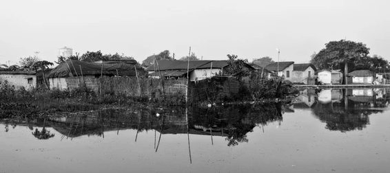
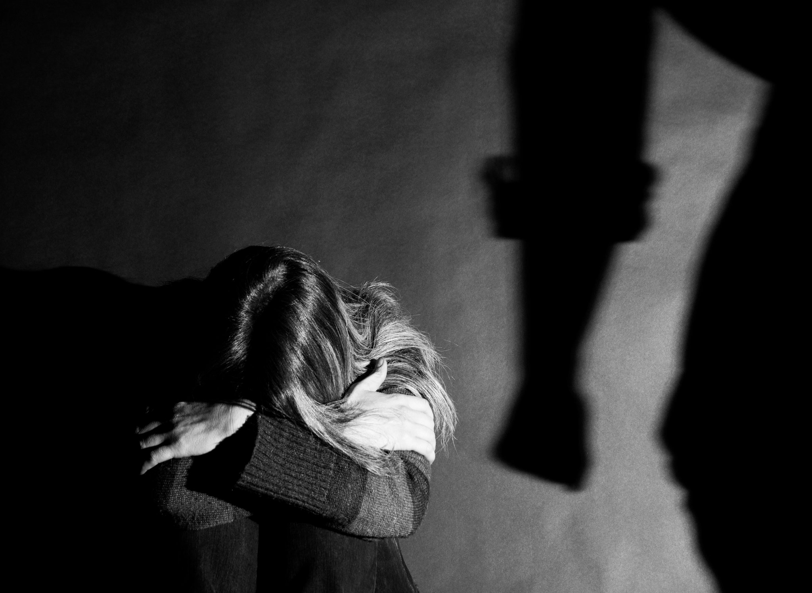

# A Mother's Story

### Growing Up

Born in 1968, I grew up in a rural village in southern China. 

I was close to my paternal grandma. When she left for Hong Kong without me, I felt betrayed. I skipped school, I hung out with bad boys, and I got trafficked to a remote village to marry an old man.

### Marriages and Births

My first pregnancy was forced. I gave birth to a baby girl, for the old man. As I despaired, my father came to rescue me out of the village. 

Later I married a man and I thought I could have my own happy life now. The first baby that I voluntarily gave birth was a boy. But he died of some infection and fever only a little older than a month. The second baby turned out to be of the sex that my mother-in-law hated. It was a girl. I fought hard to keep her alive. But I couldn't keep my third baby with me. My mother-in-law sold my baby girl, because she was a girl, who would not earn for this family but marry out to "benefit" the family of her future husband.

I suffered and I became unwell, mentally. I got divorced and I escaped. It was my parents who took back my daughter that I had kept alive and close to me, and took care of her.

When I finally got well again after nine years, I married another man, and we had a girl very soon. His family did not have a problem with the girl. But the man abused me, verbally and physically. We divorced many times, but I always remarried him for the sake of the daughter, for her to have a "complete" family with both a father and a mother. But I suffer, even to this day. My history of mental illness is catching up on me. I am on medication every single day. But still, I can be depresses at any moment. I am unhappy. 

### My Son and Daughters

I hope my son is in heaven. I hope my first ever baby girl made it out of that remote village. I hope my girl that was sold at least did not starve. My two girls whom I can still see today, oh wow, aren't they brilliant? The elder one did so well at school that she went on studying abroad on national scholarship. The younger one is in college majoring industrial design. 

Nonetheless, they feel so distant to me. For the elder one, I was not there when she grew up. For the younger one, she had seen too much of the violence in the family. And I feel guilty for all my children. 

### Dear Young Women

As they are both young women now, I dream of a gender equal future for them, free from trafficking, free from violence, and free from unfair treatment in life and work on the sole basis of their gender. Mostly importantly, as a mother, however unqualified I have been, I wish them happiness.

> I hope you find you. I hope you find love.

<iframe frameborder="0" scr="https://www.youtube.com/watch?v=C1zQr2gn8xM" allow FullScreen="true"> </iframe>
“Dear Young Woman”: a poem of empowerment - CBC Arts.
https://www.youtube.com/watch?v=C1zQr2gn8xM
